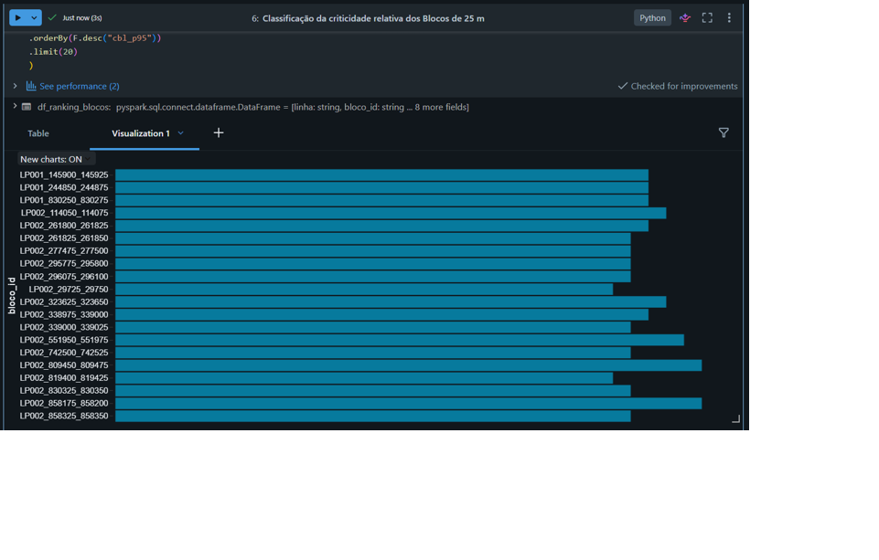
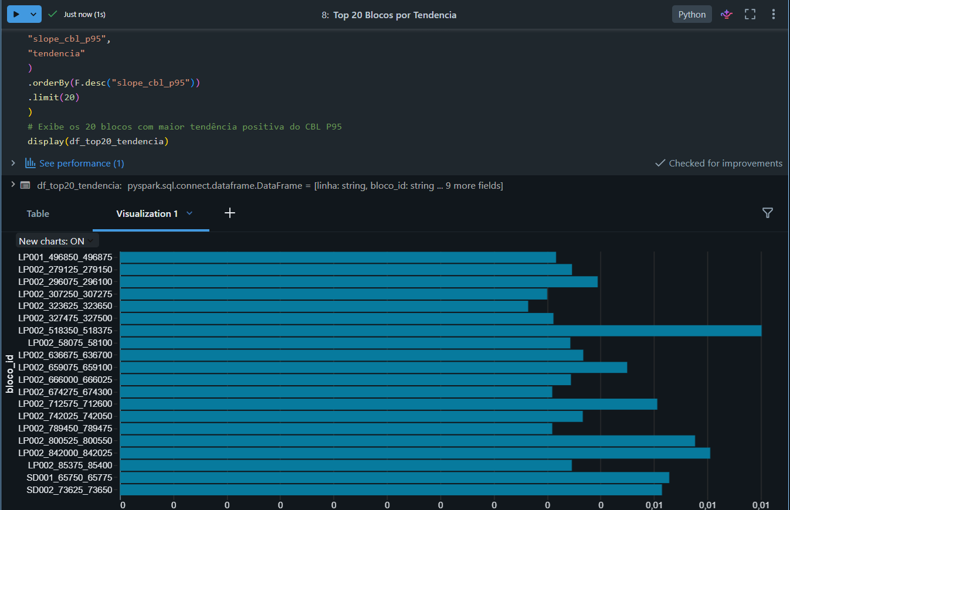
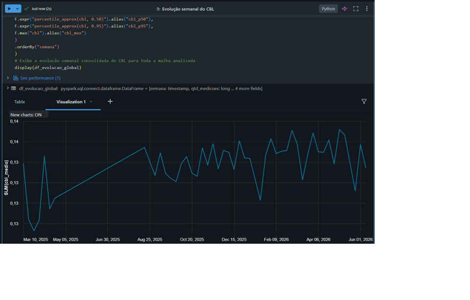

# MVP CBL/VTI — Pipeline de Dados Ferroviários em Databricks

## Visão Geral

Este projeto apresenta um MVP de Engenharia de Dados desenvolvido em **Databricks** para integração, tratamento e análise de dados de **CBL/VTI**, referências de **Locais de Instalação** e segmentação ferroviária em **Blocos de 25 m**.

Neste contexto, o **CBL corresponde a uma medição de aceleração lateral capturada pelo equipamento VTI (Vehicle-Track Interaction), instalado em locomotiva ferroviária**. Essas medições permitem observar o comportamento da interação veículo-via ao longo da ferrovia e, neste MVP, são utilizadas como indicador para análises espaciais e temporais dos segmentos monitorados.

As duas referências espaciais utilizadas no projeto possuem finalidades e granularidades diferentes.

O **Local de Instalação** representa o ativo ferroviário cadastrado no sistema de gestão da manutenção e pode abranger trechos da ordem de aproximadamente **3 km**.

Já os **Blocos de 25 m** representam uma segmentação espacial de maior granularidade, utilizada para consolidar estatisticamente as medições e permitir uma análise mais localizada do comportamento dos defeitos pontuais ao longo da via.

Dessa forma, o MVP combina duas perspectivas complementares:

    Local de Instalação
            ↓
    Representação do ativo no sistema
    de gestão da manutenção
    Granularidade da ordem de quilômetros
            │
            ▼
         Medição CBL
            │
            ▼
    Blocos de 25 m
            ↓
    Granularidade analítica
            ↓
    Consolidação estatística das medições

A solução foi estruturada utilizando arquitetura **Medalhão**, com camadas **Landing, Bronze, Silver e Gold**, permitindo transformar fontes originalmente independentes em uma base analítica integrada por posição ferroviária.

O MVP foi desenvolvido com foco em três perguntas principais:

1. **Quais Blocos de 25 m apresentam maior criticidade relativa de CBL?**
2. **Quais blocos apresentam maior tendência de crescimento do CBL?**
3. **Como o CBL evolui globalmente ao longo do período analisado?**

---

## Objetivo

Construir um pipeline de dados capaz de:

- ingerir e organizar diferentes fontes ferroviárias;
- padronizar referências espaciais;
- integrar medições CBL com Locais de Instalação;
- associar medições CBL aos respectivos Blocos de 25 m;
- avaliar qualidade, completude e cobertura dos relacionamentos;
- gerar agregações temporais;
- identificar segmentos com maiores valores relativos de CBL;
- identificar segmentos com tendência crescente do indicador;
- acompanhar a evolução temporal global do CBL.

---

## Arquitetura

O projeto utiliza uma arquitetura Medalhão simplificada:

    Arquivos de origem
           │
           ▼
        Landing
           │
           ▼
        Bronze
           │
           ▼
        Silver
           │
           ▼
         Gold
           │
           ├── Tabela fato
           ├── Agregação por bloco
           ├── Agregação diária
           ├── Agregação semanal
           └── Tendência por bloco
           │
           ▼
    Qualidade de Dados
           │
           ▼
        Análises

A separação em camadas permite manter rastreabilidade entre os dados de origem, os tratamentos realizados e os produtos analíticos utilizados nas análises finais.

---

## Fontes de Dados

O MVP utiliza três fontes principais.

### CBL/VTI

Base contendo as medições provenientes do monitoramento **VTI instalado em locomotiva ferroviária**.

O **CBL representa uma medição de aceleração lateral**, utilizada neste MVP como variável para observar espacial e temporalmente o comportamento da interação veículo-via ao longo dos trechos monitorados.

Entre os campos utilizados estão:

- identificação da medição;
- linha ferroviária;
- KM;
- metro;
- data e hora;
- tipo da medição;
- valor CBL;
- velocidade;
- direção.

Para o MVP foram consideradas as medições identificadas como `CBL-PEAK`.

### Locais de Instalação

A base de **Locais de Instalação** representa os ativos ferroviários cadastrados no sistema de gestão da manutenção.

Cada Local possui uma referência espacial definida por:

    linha
    ponto_partida
    ponto_final
    taxonomia

Esses ativos podem representar trechos da ordem de aproximadamente **3 km**, fornecendo uma referência de maior abrangência para relacionar as medições CBL à estrutura utilizada na gestão da manutenção.

No pipeline, os limites de cada Local são utilizados para identificar em qual ativo determinada medição CBL está posicionada.

### Blocos de 25 m

Os **Blocos de 25 m** representam uma segmentação espacial de maior granularidade utilizada para consolidar estatisticamente as medições ao longo da ferrovia.

Enquanto o Local de Instalação fornece a referência do ativo dentro do sistema de gestão da manutenção, o Bloco de 25 m permite analisar o comportamento das medições em segmentos menores, aumentando a resolução espacial para avaliação de defeitos pontuais.

Cada bloco possui:

    linha
    km_inicio
    km_fim
    inicio_m
    fim_m
    bloco_id

A extensão dos segmentos foi validada durante o processo de qualidade dos dados.

A relação conceitual utilizada no MVP pode ser resumida como:

    FERROVIA
       │
       ▼
    Local de Instalação
    ≈ 3 km
       │
       ├── Bloco 25 m
       ├── Bloco 25 m
       ├── Bloco 25 m
       ├── ...
       │
       ▼
    Medições CBL
       │
       ▼
    Indicadores estatísticos por bloco

Essa combinação permite manter simultaneamente:

- uma **referência compatível com a gestão da manutenção**, por meio dos Locais de Instalação;
- uma **referência analítica de maior granularidade**, por meio dos Blocos de 25 m.

---

## Pipeline de Dados

### Landing

A camada **Landing** representa a área de entrada dos arquivos utilizados pelo pipeline.

As fontes são organizadas separadamente em diretórios para:

    CBL
    Locais
    Blocos

### Bronze

A camada **Bronze** preserva os dados próximos à estrutura original das fontes.

Foram criadas as tabelas:

    mvp_vti.bronze.bronze_cbl_raw
    mvp_vti.bronze.bronze_locais_raw
    mvp_vti.bronze.bronze_blocos_raw

Também foram adicionados metadados de rastreabilidade:

    _ingestion_ts
    _source

Essa camada funciona como ponto inicial persistido do pipeline.

### Silver

A camada **Silver** realiza os principais tratamentos de padronização, tipagem e preparação espacial.

As tabelas produzidas são:

    mvp_vti.silver.silver_cbl
    mvp_vti.silver.silver_locais
    mvp_vti.silver.silver_blocos

#### Normalização da posição ferroviária

Uma das principais transformações do projeto foi converter a referência ferroviária original de **KM + metro** em uma posição única expressa em metros acumulados:

    posicao_m = km_major × 1000 + kp_minor

Exemplo:

    KM = 7
    Metro = 145

    posicao_m = 7145

Essa normalização permite comparar diretamente a posição das medições CBL com os intervalos espaciais das demais fontes.

#### Normalização dos Locais

Os limites dos Locais de Instalação foram convertidos para:

    inicio_m
    fim_m

Essa representação permite relacionar cada medição CBL ao ativo correspondente no sistema de gestão da manutenção.

#### Normalização dos Blocos

Os limites originalmente representados em quilômetros foram convertidos para metros:

    inicio_m
    fim_m

Também foi criado um identificador para cada segmento:

    bloco_id

O identificador é formado pela combinação da linha ferroviária e dos limites espaciais do bloco.

Essa segmentação fornece a granularidade de **25 m** utilizada nas consolidações estatísticas das medições.

---

## Integração Espacial

A camada **Gold** utiliza relacionamentos por intervalo para integrar as três fontes.

A posição ferroviária normalizada funciona como elemento comum entre as medições CBL e as duas referências espaciais.

### CBL × Locais

Uma medição é associada a um Local quando:

    CBL.linha = Local.linha

e:

    local_inicio_m <= posicao_m < local_fim_m

Esse relacionamento permite associar a medição CBL ao **ativo representado no sistema de gestão da manutenção**.

O relacionamento foi realizado preservando também as medições sem correspondência, permitindo avaliar posteriormente a cobertura da integração.

### CBL × Blocos de 25 m

A mesma lógica foi utilizada para associar cada medição ao respectivo bloco:

    CBL.linha = Bloco.linha

e:

    bloco_inicio_m <= posicao_m < bloco_fim_m

Esse segundo relacionamento fornece uma referência espacial de maior granularidade, permitindo consolidar estatisticamente as medições em segmentos de **25 m**.

Conceitualmente, a integração pode ser representada como:

                     Medição CBL
                          │
                  linha + posicao_m
                          │
              ┌───────────┴───────────┐
              ▼                       ▼
    Local de Instalação          Bloco de 25 m
              │                       │
              ▼                       ▼
    Referência do ativo        Referência analítica
    na manutenção              de maior granularidade

---

## Camada Gold

A principal tabela analítica construída foi:

    mvp_vti.gold.fato_cbl_bloco

O grão da tabela pode ser interpretado como:

> Uma medição CBL em determinado instante e posição ferroviária, enriquecida com as referências espaciais de Local de Instalação e Bloco de 25 m quando disponíveis.

A tabela reúne informações como:

    id
    date_time
    linha
    km_major
    kp_minor
    posicao_m
    cbl
    track_no
    speed
    direction
    taxonomia
    local_inicio_m
    local_fim_m
    sem_local
    bloco_id
    bloco_inicio_m
    bloco_fim_m
    sem_bloco

Essa estrutura permite analisar uma mesma medição sob duas perspectivas:

    Perspectiva de manutenção
            ↓
    Local de Instalação

    Perspectiva analítica
            ↓
    Bloco de 25 m

Além da tabela fato, foram construídos produtos analíticos adicionais.

### Agregação geral por bloco

Tabela:

    mvp_vti.gold.agg_cbl_bloco

Contém indicadores consolidados por Bloco de 25 m, incluindo:

    qtd_medicoes
    cbl_medio
    cbl_max
    cbl_p95
    cbl_std
    primeira_medicao
    ultima_medicao

### Agregação diária

Tabela:

    mvp_vti.gold.agg_cbl_bloco_dia

Permite acompanhar o comportamento diário do CBL por segmento.

### Agregação semanal

Tabela:

    mvp_vti.gold.agg_cbl_bloco_semana

Foi utilizada para reduzir oscilações diárias e construir séries temporais por bloco.

### Tendência por bloco

Tabela:

    mvp_vti.gold.agg_degradacao_bloco

Consolida os indicadores de tendência temporal calculados a partir das séries semanais.

---

## Qualidade dos Dados

Foi criado um notebook específico para validação da qualidade dos dados:

`04_Qualidade_Dados`

As verificações foram organizadas em diferentes dimensões.

### Completude

Foram avaliados campos essenciais como:

    linha
    km_major
    kp_minor
    posicao_m
    date_time
    cbl

### Consistência da referência ferroviária

Foi validada a faixa:

    0 <= kp_minor < 1000

Também foi verificada a consistência da regra:

    posicao_m = km_major × 1000 + kp_minor

### Consistência dos Locais

Foi verificado se:

    fim_m > inicio_m

### Consistência dos Blocos

Foram avaliados:

- extensão dos segmentos;
- unicidade do `bloco_id`;
- consistência dos limites espaciais.

### Integridade dos relacionamentos

Após a construção da Gold, foi validado se as medições associadas permaneciam dentro dos intervalos correspondentes.

Para Blocos:

    bloco_inicio_m <= posicao_m < bloco_fim_m

Para Locais:

    local_inicio_m <= posicao_m < local_fim_m

---

## Cobertura Espacial

A tabela fato consolidou **42.881 medições CBL**.

### CBL × Locais

| Indicador | Resultado |
|---|---:|
| Total CBL | 42.881 |
| Com Local | 39.546 |
| Sem Local | 3.335 |
| Cobertura | **92,22%** |

Esse indicador representa a capacidade de associar as medições CBL aos ativos cadastrados na referência de Locais de Instalação.

### CBL × Blocos de 25 m

| Indicador | Resultado |
|---|---:|
| Total CBL | 42.881 |
| Com Bloco | 41.499 |
| Sem Bloco | 1.382 |
| Cobertura | **96,78%** |

Também foi verificada a existência de associações ambíguas:

    Medições associadas a mais de um bloco: 0

Esse resultado indica que a lógica espacial utilizada para associação aos Blocos de 25 m não produziu múltiplas associações para uma mesma medição.

---

## Cobertura Temporal

O histórico utilizado no MVP possui **277 dias distintos com medições**.

Período observado:

    15/03/2025 a 11/06/2026

Também foi avaliada a quantidade de semanas disponíveis individualmente para cada Bloco de 25 m.

Para o cálculo de tendência foi adotado um histórico mínimo de **4 semanas distintas**.

Blocos abaixo desse critério não foram utilizados no cálculo da tendência temporal.

---

## Resultados Analíticos

O MVP foi encerrado com três perguntas analíticas principais.

### 1. Quais blocos apresentam maior criticidade relativa de CBL?

A comparação entre os Blocos de 25 m utiliza principalmente o **CBL P95**.

O percentil 95 foi escolhido para representar a região superior da distribuição do CBL sem depender exclusivamente de valores máximos pontuais.

A utilização dos Blocos de 25 m permite que essa comparação seja realizada em uma granularidade espacial menor que a dos Locais de Instalação, favorecendo a identificação de segmentos com comportamento relativo mais elevado dentro de ativos que podem possuir alguns quilômetros de extensão.

#### Interpretação

A classificação representa **criticidade relativa dentro da população analisada**.

Portanto, um bloco classificado como mais crítico significa que apresenta valores de CBL P95 relativamente superiores aos demais segmentos analisados.

Essa classificação **não representa, isoladamente, um limite técnico de manutenção ou condição física da via**.

---

### 2. Quais blocos apresentam maior tendência de crescimento do CBL?

A tendência foi calculada utilizando a série semanal de cada Bloco de 25 m.

O processo pode ser resumido como:

    Medições CBL
         ↓
    Agregação semanal
         ↓
    CBL médio e CBL P95
         ↓
    Regressão linear
         ↓
    slope_cbl_p95
         ↓
    Tendência por bloco

A função de regressão calcula a inclinação da série temporal:

    slope > 0  → tendência crescente
    slope < 0  → tendência decrescente
    slope ≈ 0  → aproximadamente estável

#### Interpretação

Os blocos com maiores valores positivos de `slope_cbl_p95` apresentam maior tendência relativa de crescimento do CBL P95 ao longo do período analisado.

No contexto deste MVP, essa tendência é utilizada como **proxy de degradação dinâmica**, não devendo ser interpretada isoladamente como diagnóstico da condição física da via.

---

### 3. Como o CBL evoluiu globalmente ao longo do período?

Para avaliar o comportamento temporal global, as medições foram agregadas semanalmente.

Foram calculados:

    qtd_medicoes
    cbl_medio
    cbl_p50
    cbl_p95
    cbl_max

A comparação entre média e P95 permite observar simultaneamente:

- o comportamento geral das medições;
- o comportamento da região superior da distribuição.

Essa análise fornece uma visão temporal consolidada do indicador durante o período disponível no MVP.

---

## Principais Resultados

| Indicador | Resultado |
|---|---:|
| Medições CBL na tabela fato | 42.881 |
| Cobertura CBL × Locais | 92,22% |
| Cobertura CBL × Blocos de 25 m | 96,78% |
| Associações a mais de um bloco | 0 |
| Dias distintos com medições | 277 |
| Início do período | 15/03/2025 |
| Final do período | 11/06/2026 |
| Histórico mínimo para tendência | 4 semanas |

---

## Evidências Técnicas

As evidências de execução e validação do pipeline estão organizadas em:

`docs/evidencias/`

por etapa:

    01_landing
    02_bronze
    03_silver
    04_gold
    05_qualidade
    06_analises

Entre as principais evidências estão:

- leitura das fontes;
- persistência das tabelas Bronze;
- completude da Silver;
- validação dos Blocos de 25 m;
- cobertura CBL × Locais;
- cobertura CBL × Blocos;
- tabela fato integrada;
- agregações diária e semanal;
- integridade espacial;
- cobertura temporal;
- resultados analíticos finais.

---

## Estrutura do Repositório

    mvp_cbl_vti/
    │
    ├── README.md
    ├── LICENSE
    ├── .gitignore
    │
    ├── notebooks/
    │   ├── 01_Bronze.ipynb
    │   ├── 02_Silver.ipynb
    │   ├── 03_Gold.ipynb
    │   ├── 04_Qualidade_Dados.ipynb
    │   └── 05_Analises.ipynb
    │
    └── docs/
        ├── arquitetura/
        ├── modelagem/
        └── evidencias/
            ├── 01_landing/
            ├── 02_bronze/
            ├── 03_silver/
            ├── 04_gold/
            ├── 05_qualidade/
            └── 06_analises/

---

## Notebooks

### `01_Bronze`

Responsável por:

- leitura das fontes;
- inclusão de metadados de ingestão;
- persistência das tabelas Bronze;
- validação inicial dos volumes.

### `02_Silver`

Responsável por:

- filtro das medições CBL;
- padronização dos campos;
- tipagem;
- normalização da posição ferroviária;
- preparação espacial dos Locais;
- preparação dos Blocos de 25 m;
- persistência das tabelas Silver.

### `03_Gold`

Responsável por:

- relacionamento CBL × Locais;
- relacionamento CBL × Blocos;
- construção da tabela fato;
- agregação diária;
- agregação geral por bloco;
- agregação semanal;
- cálculo da tendência temporal.

### `04_Qualidade_Dados`

Responsável por:

- completude;
- consistência;
- unicidade;
- integridade espacial;
- cobertura dos relacionamentos;
- cobertura temporal;
- validação do histórico utilizado na tendência.

### `05_Analises`

Responsável pelas três análises finais:

1. **Criticidade relativa**
2. **Tendência por bloco**
3. **Evolução semanal global**

---

## Tecnologias Utilizadas

- **Databricks**
- **Apache Spark**
- **PySpark**
- **Delta Lake**
- **Python**
- **SQL / Spark SQL**
- **GitHub**
- **Excel** como formato das fontes utilizadas no MVP

---

## Decisões de Projeto

### Dupla referência espacial

A utilização simultânea de **Locais de Instalação** e **Blocos de 25 m** foi uma decisão central do projeto.

Os Locais permitem relacionar as medições à estrutura de ativos utilizada na gestão da manutenção, enquanto os Blocos fornecem uma granularidade espacial menor para consolidação estatística e análise dos defeitos pontuais.

Assim, o pipeline preserva a relação:

    Gestão da manutenção
            ↓
    Local de Instalação
            ↓
    Medições CBL
            ↓
    Blocos de 25 m
            ↓
    Análise estatística localizada

### Preservação dos registros sem correspondência

Os relacionamentos espaciais utilizam `left join`.

Dessa forma, medições sem Local ou Bloco correspondente não são descartadas.

Elas permanecem identificadas por flags como:

    sem_local
    sem_bloco

Isso permite medir a cobertura das bases de referência sem eliminar dados válidos de CBL.

### Uso do P95

O `cbl_p95` foi utilizado como referência para comparação relativa entre blocos por representar a região superior da distribuição sem depender exclusivamente do valor máximo.

### Agregação semanal

A série semanal foi utilizada na análise de tendência para reduzir oscilações de curto prazo e criar uma referência temporal comum entre os blocos.

### Histórico mínimo

O cálculo de tendência foi limitado aos blocos com pelo menos **quatro semanas distintas de dados**.

---

## Limitações do MVP

Este projeto deve ser interpretado como um **MVP de integração e análise de dados**, e não como um sistema definitivo de diagnóstico ferroviário.

Entre as principais limitações estão:

- cobertura espacial inferior a 100% nas bases de Locais e Blocos;
- diferenças de cobertura temporal entre os segmentos;
- utilização do CBL como indicador analítico sem definição, neste MVP, de limites técnicos de manutenção;
- criticidade baseada em comparação relativa entre os blocos analisados;
- tendência baseada em regressão linear simplificada;
- ausência de validação causal entre crescimento do CBL e condição física da via;
- ausência de modelos preditivos ou Machine Learning nesta versão.

---

## Trabalhos Futuros

Possíveis evoluções do MVP incluem:

- cálculo e avaliação formal da tendência global do CBL;
- ampliação do histórico de medições;
- investigação dos registros sem correspondência espacial;
- integração com novas fontes de inspeção ferroviária;
- definição de critérios técnicos de criticidade com apoio de especialistas;
- análise da influência de velocidade e demais variáveis operacionais;
- comparação entre diferentes períodos;
- desenvolvimento de indicadores adicionais de degradação;
- integração com ferramentas de visualização;
- evolução para modelos preditivos após validação técnica das variáveis e critérios.

Essas possibilidades foram mantidas fora do escopo atual para preservar o objetivo de entrega do MVP.

---

## Reprodutibilidade

A sequência recomendada de execução dos notebooks é:

    01_Bronze
        ↓
    02_Silver
        ↓
    03_Gold
        ↓
    04_Qualidade_Dados
        ↓
    05_Analises

Os notebooks dependem das tabelas produzidas nas etapas anteriores.

Os arquivos de origem não fazem parte deste repositório. Para reprodução em outro ambiente, é necessário disponibilizar fontes com estrutura equivalente e ajustar os caminhos da camada Landing.

---

## Autoavaliação
 
O desenvolvimento deste MVP foi realizado dentro da minha própria área de atuação ferroviária, o que representou uma oportunidade importante de aplicar novas ferramentas em desafios que, até então, eu costumava tratar principalmente com Excel e Power BI. Ao estruturar um pipeline de dados no Databricks utilizando a arquitetura Medalhão, com camadas Landing, Bronze, Silver e Gold, pude perceber diferenças significativas em relação à forma como eu vinha lidando com esse tipo de problema.
 
A primeira vantagem que ficou clara foi a **organização e a separação das etapas do tratamento**. Cada camada passou a ter um papel bem definido, o que reduziu significativamente aquela sensação de mistura entre dado bruto, dado tratado e dado analítico que costuma aparecer em fluxos baseados em planilhas. Junto a isso, senti uma **rastreabilidade muito maior entre a fonte, as transformações e o produto final**, o que fortalece a confiança nos resultados apresentados.
 
Também percebi ganhos importantes em relação à **reprodutibilidade e escalabilidade do pipeline**. Diferente de análises pontuais que precisam ser refeitas a cada nova rodada, o pipeline permite reexecutar o processo por completo com muito menos esforço manual. Da mesma forma, as **validações de qualidade passaram a ser mais estruturadas**, deixando de depender apenas de conferências visuais e passando a incluir verificações objetivas de completude, consistência, integridade espacial e cobertura dos relacionamentos.
 
Outro ponto que considerei especialmente relevante foi a **integração consistente entre bases com granularidades diferentes**. Trabalhar simultaneamente com CBL/VTI, Locais de Instalação e Blocos de 25 m exigiu um cuidado maior com regras espaciais, o que evidenciou o quanto uma referência posicional bem definida contribui para produzir análises mais confiáveis. Isso também abriu espaço para **evoluir análises futuras** com maior segurança, reduzindo a dependência de tratamentos manuais e repetitivos que dificilmente se sustentam quando o volume de dados cresce.
 
A construção do pipeline também reforçou a importância de **compreender a estrutura dos comandos e, principalmente, as relações entre as tabelas**. Foi esse entendimento que me permitiu, ao longo da jornada, confirmar que o caminho técnico estava adequado. Os checks de visualização, as amostras exibidas em diferentes momentos e as validações de cobertura foram fundamentais para manter essa segurança durante o desenvolvimento e para identificar ajustes de forma natural, sem depender apenas do resultado final para avaliar se a lógica estava correta.
 
Ao mesmo tempo, considero importante fazer uma reflexão honesta sobre oportunidades de desenvolvimento. Embora eu conheça bem o contexto da minha área, meu conhecimento aprofundado sobre o fenômeno específico analisado neste MVP ainda é limitado. Em uma situação semelhante à de um desenvolvedor que atende às demandas de um time especialista no fenômeno, percebo que preciso ampliar meu domínio técnico sobre o assunto para interpretar melhor os resultados, transformar requisitos em produtos analíticos mais robustos e sustentar decisões técnicas mais consistentes ao longo do processo.
 
Encerro esta autoavaliação com a sensação de que este trabalho foi mais do que uma entrega técnica. Ele funcionou como uma experiência prática de crescimento, tanto em termos de ferramentas quanto em maturidade profissional, ao me colocar diante de decisões técnicas reais, restrições reais e da necessidade de traduzir um contexto ferroviário em um pipeline analítico consistente.

---

## Autor

**Antonio Felipe**  
Engenharia / Monitoramento Ferroviário  
São Luís — Maranhão
